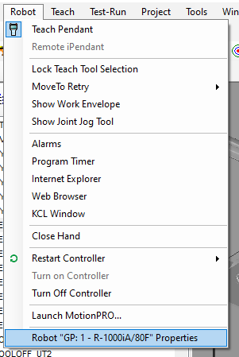
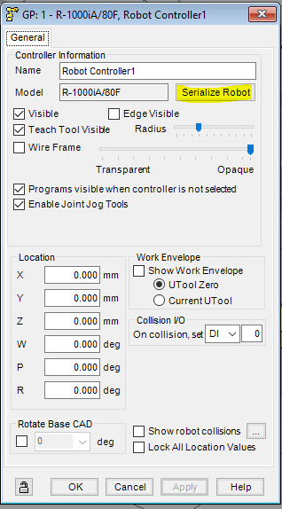
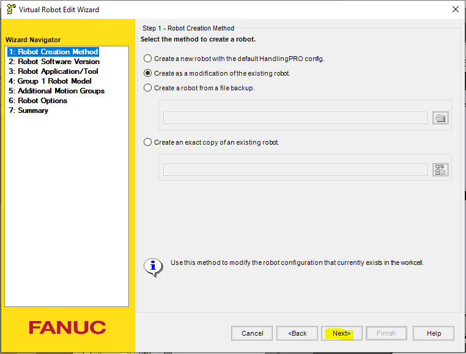
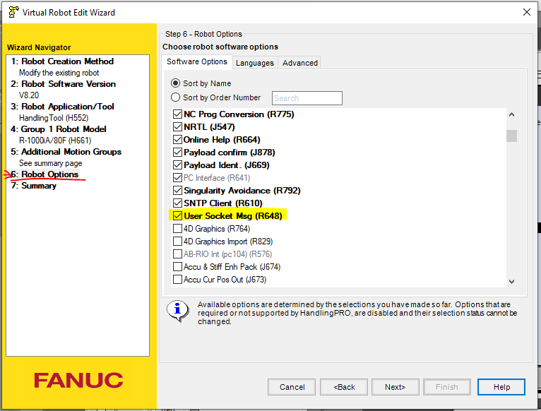

# Add Software Options (R648: User Socket Message)

* Go to the robot properties in roboguide

* Click the `Serialize Robot` button

* Modify the robot config, and click `Next` button until you reach the **Robot Options**

* Add the option `User Socket Msg (R648)`. Click next, and click finish.

